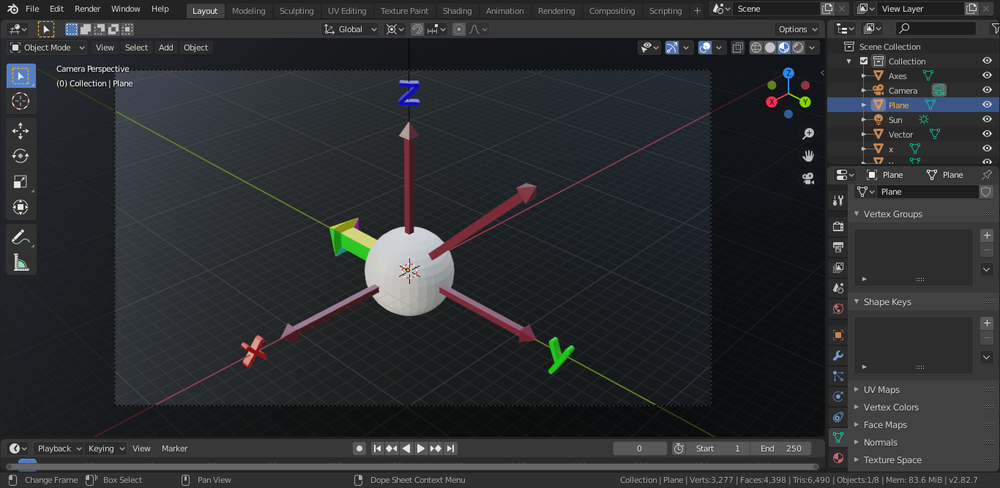

# Rotation Calculator:
A blender add-on that can be used to visualize rotations in 3 dimensions.  Useful applications include visualizing rotations on the bloch sphere corresponding to quantum operators on a single qbit.
## List of Features:

### Visualize Rotations in Real Time

### Automatically Render Scene Before and After Rotation
The add-on automatically renders a before and after shot of the scene, conveniently stitching them into a single image for later analysis.

The render is stored as `rotated.png` in the file location in which blender is run.

### Set the Initial Rotation of the Vector Relative to Its Default Orientation

### Included .blend File to Be Used with Add-On
Or use with your own Blender projects.

## Installation:
The Rotation Calculator add-on can be installed like any other 3rd party blender add-on.  This directory contains two files: 
`rotation_calc_addon.py` and  `rotation_calc.blend `

The `.py` file is the add-on, and the `.blend` file is an example project to test the add-on.

To install the add-on in your blender project, in the blender menu, navigate to `Edit`→`Preferences...`

Once the preferences window is open, click on the `Add-Ons` tab.

Click on the `install...` button, navigate to the location of `rotation_calc_addon.py`, select the file, and select `install`

Finally, to enable the add-on, check the box next to the add-on name.

The add-on should now be installed.  It can be accessed by pressing `F3` on your keyboard to open the add-on menu, and searching for `Rotate Vector`

## How to Use:
The Rotation Calculator blender add-on operates on objects in the scene with the name `Vector` (case sensitive).  It rotates the vector object around its local origin.  The add-on can be accessed by pressing `F3` on your keyboard to open the add-on menu, and searching for `Rotate Vector`.  There are several parameters that the user must specify:

### Radians:
a boolean value that reads the input angles in radians if selected, and reads the angles as degrees in deselected.

Default: selected

### Initial Orientation X, Y, Z:
three numeral values that specify the initial orientation of the vector as a rotation from the default orientation.

Defaults: 0.00

### Rotation [List]:
the rotation that the transformation will apply to the vector around the X, Y and Z axes.  The numeral values for these angles can either be entered individually into the 3 separate fields, or as a string storing a list of the form [X, Y, Z].  

Defaults: 0.00

### Reset Vector after Rotation:
a boolean value that resets the orientation of the vector to the initial orientation after the operation if selected.

Default: selected

## Disclaimer
> :warning: **When Using this Add-On in Your Projects**: this add-on uses multithreading to move the vector in real time.  This can cause blender to crash unexpectedly on low performance machines.  For this reason, make sure to save your project before operating on vector objects with the add-on to avoid lost progress.